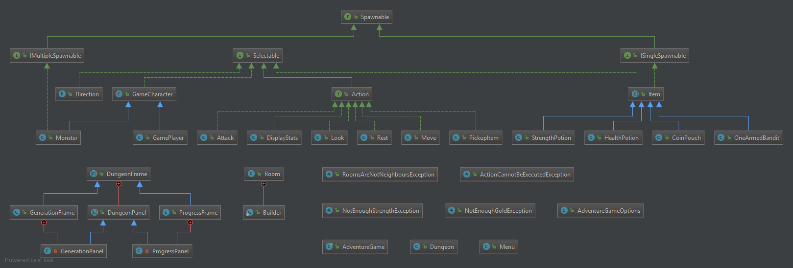
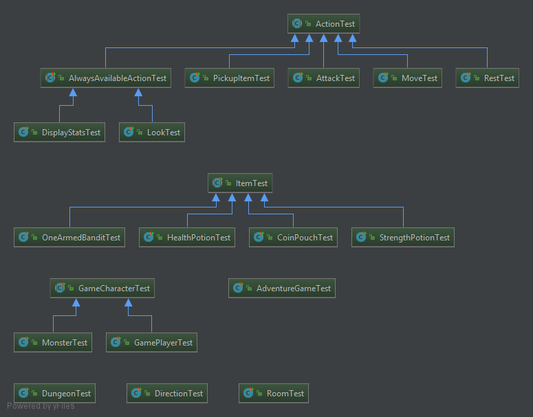

# COO TD1

## Introduction
Ce TD a pour but de créer un mini jeu d'un donjon duquel on doit s'évader. Ce donjon se comporte de plusieurs salles qui peuvent contenir des monstres et des items.

## How to

 - Clonez le repository: `git clone https://gitlab-etu.fil.univ-lille1.fr/caroni/COO-TD1/`
 - Une fois dans le dossier cloné, compilez avec Maven: `mvn clean package`
 - Lancez le .jar généré `java -jar target/COO-TD1-1.0-SNAPSHOT.jar`
 - Eventuellement, générez la javadoc avec`mvn javadoc:javadoc`. Il est ensuite disponible dans `target/site/apidoc/index.html`

## Options de lancement

## UML et précisions code
Les jeu lui-même se trouve dans `fil.coo.AdventureGame`. Cette classe contient le `main()`qui lance le programme et la logique du jeu. Les principaux éléments de ce projet sont rassemblés dans les pacquets suivants:

 - `actions`: les classes définissants les différents actions que peut faire l'utilisateur.
 - `spawnables`: les classes pouvant être "produits" comme les monstres ou items. Il contient lui même les paquets suivants:
	 - `beings`: les charactères "vivants" du jeu.
	 - `items`: les objets pouvants êtres utilisés par le joueur.
 - `structures`: le donjon lui même
 - `util`: des classes sans hiéarchie spécifique.
 - `gui`: des classes contenant des JFrame permettant de visualiser l'état du jeu pour le débuggage.

Voici l'UML du pacquet principal `fil.coo`:

### Actions
Les actions héritent tous de la classe `Action` qui spécifie comment le joueur (`GamePlayer`) doit pouvoir y accèder. Voici l'UML des classes d'actions:

### Spawnables
#### Beings

#### Items

### Structures
Ce pacquet contient les classes `Room` qui composent le donjon, et `Dungeon`, qui permet de créer gérer un ensemble de salles qui composent un donjon.

 - `Room` contient une classe statique `Room.Builder` qui permet de créer des salles avec seulement les caractéristiques qui nous intéressent. Ainsi, on peut créer un salle sans "spawnables", avec que des items, que des monstres ou les deux.
 - `Dungeon` permet de générer un donjon aléatoire grâce à une liaison récursive et aléatoire de salles. Ainsi, chaque jeu est unique. L'algorithme cherche à relier tous les salles voisines`y`de `x`, à `x` si `y`n'a pas encore été relié à une autre salle.
Voici le corps de l'algorithme.

 1. Choisis une salle au hasard. Ceci devient la salle "actuelle". Marque la comme visitée.
 2. Choisis une salle adjacente au hasard, si et seulement si cette salle n'a pas encore été visité.
	 3. Lie ces deux salles de manière à qu'on puisse voyager entre les deux.
	 4. Marque cette salle comme visitée.
	 4. Définie la salle adjacente comme salle "actuelle" et répète à partie de l'étape 2.
 3. Si la salle actuelle n'a pas de salles adjacentes non visités, reviens vers la dernière salle "actuelle" et répète à partir de l'étape 2.
 4. Quand on ne peut plus revenir en arrière, tous les salles ont été reliés et tous les salles sont accessibles l'un à l'autre par l'intermédiare de leurs voisins.

### Util et AdventureGame
`Util` contient les classes `Menu` et `AdventureGameOptions`.

 - `Menu` est un singleton,  à travers lequel on peut accèder à la méthode `T chooseElement`, qui permet de présenter une liste de `Selectable`au joueur et d'en savoir son choix. Le pattern de singleton permet à tous les classes ayant besoin d'interagir avec le joueur de pouvoir le faire facilement sans devoir avoir en attribut l'instance du jeu principal.
 - `AdventureGameOptions` hérite de `OptionsBase`, une classe d'une librarie permettant de définir et récupérer les options de la ligne de commande du programme.

Comme expliqué avant, `AdventureGame` permet de lancer le programme, mettre en place tous les éléments du jeu et le déroulement du jeu jusqu'à la mort ou victoire du joueur.

### Gui
Ce pacquet contient des JFrame facilitant le débuggage en permettant de visualiser soit la génération du jeu soit le parcours du joueur dans le donjon.
Comme on a deux buts différents, mais qu'on veut toujours afficher le donjon, une classe mère, `DungeonFrame`, permet à lui seul d'afficher le donjon. Il contient une classe interne `DungeonPanel`, un JPanel dans lequel on dessine le donjon. Cette classe contient une méthode abstraite `showprogress()` qui permet de dessiner par dessus le donjon et montrer une forme de progrès: l'algorithme de génération d'accès aux salles voisines, ou le progrès du joueur dans le donjon.
Ainsi, les classes `GenerationFrame` et `ProgressFrame` étendent `DungeonFrame` pour ensuite surcharger `showProgress`.

### Tests
Les tests permettent de vérifier le fonctionnement des classes et méthodes de ce projet. Ainsi, nous testons les effets de items, actions, les bon fonctionnement des salles...

